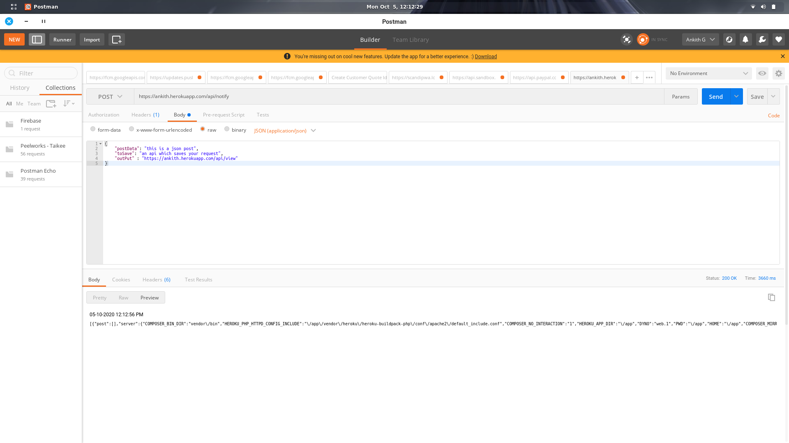
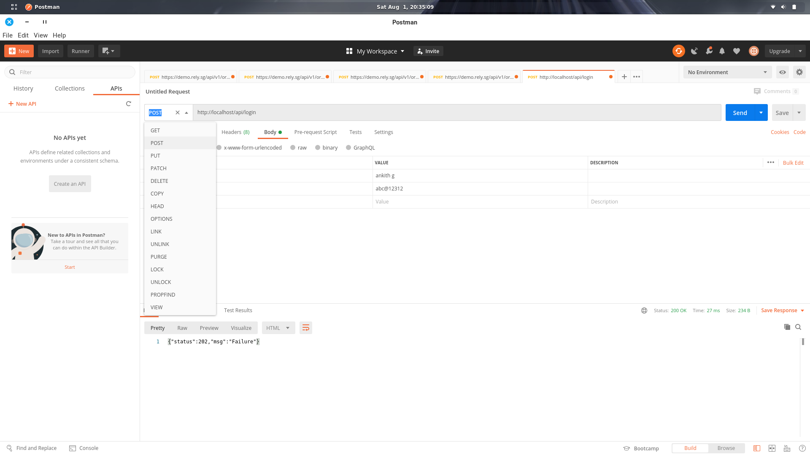

# Content
1. Api
	1. /api/notify - stores data like post, server data and current time & date
	2. /api/view - views the data which is saved via `/api/notify` api

2. Database connection
	1. Database connection
	2. Ideology of MVC
	3. Ideology behind Api 
	4. {folder-structure}/DB/db.php
		>       $servername = "localhost";
		> 	    $dbUserName = "{db name}";
		> 	    $dbPassword = "{db password}";
		> 	    $dbname = "{database name}";
3. Login Api 

